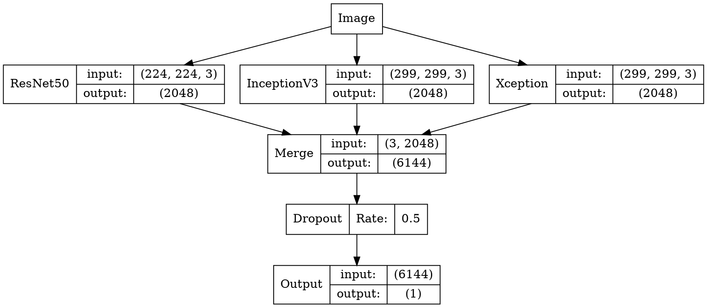

In this project, we use Keras to build a deep convolutional neural network to identify whether a picture is a cat or a dog. The accuracy on the verification set can reach 99.6%. It is recommended to use a GPU to run the project. The version of Keras used in this project is 1.2.2. If you are using a more advanced version, there may be a slight parameter change.

# Dogs vs. Cats Redux: Kernels Edition

The dataset comes from a competition on kaggle: [Dogs vs. Cats](https://www.kaggle.com/c/dogs-vs-cats-redux-kernels-edition), with 25,000 training sets, cats and dogs Half of it. There are 12,500 test sets, and a cat or a dog is not defined.

```
➜ ls train | head
cat.0.jpg
cat.1.jpg
cat.10.jpg
cat.100.jpg
cat.1000.jpg
cat.10000.jpg
cat.10001.jpg
cat.10002.jpg
cat.10003.jpg
cat.10004.jpg
➜ ls test | head
1.jpg
10.jpg
100.jpg
1000.jpg
10000.jpg
10001.jpg
10002.jpg
10003.jpg
10004.jpg
10005.jpg
```

Here are some examples in training data：


# Data preprocessing

The file name of our dataset is named like `type.num.jpg`, such as `cat.0.jpg`. ImageDataGenerator of Keras requires different types of images to be grouped into different folders. So we need to preprocess the data set. The main idea here is to create a symbolic link, which don't need to copy the image and taking up more space.

```py
import os
import shutil

train_filenames = os.listdir('train')
train_cat = filter(lambda x:x[:3] == 'cat', train_filenames)
train_dog = filter(lambda x:x[:3] == 'dog', train_filenames)

def rmrf_mkdir(dirname):
    if os.path.exists(dirname):
        shutil.rmtree(dirname)
    os.mkdir(dirname)

rmrf_mkdir('train2')
os.mkdir('train2/cat')
os.mkdir('train2/dog')

rmrf_mkdir('test2')
os.symlink('../test/', 'test2/test')

for filename in train_cat:
    os.symlink('../../train/'+filename, 'train2/cat/'+filename)

for filename in train_dog:
    os.symlink('../../train/'+filename, 'train2/dog/'+filename)
```

We can see the structure of the folder from the following picture. There are two folders in train2, which are cats and dogs, and each folder has 12,500 images.

```
├── test [12500 images]
├── test.zip
├── test2
│   └── test -> ../test/
├── train [25000 images]
├── train.zip
└── train2
    ├── cat [12500 images]
    └── dog [12500 images]
```

# Export feature vector

For this topic, it is better to use a pre-trained network. After the previous tests, we tested different networks such as ResNet50, but the rankings are not high. It ranked only one or two hundred, so we need to improve our model performance. Then an effective method is to combine different models to get a good effect. We can save the feature vectors of different network outputs for subsequent training. Once we save the feature vector, it can be easily trained even in a normal notebook.

```py
from keras.models import *
from keras.layers import *
from keras.applications import *
from keras.preprocessing.image import *

import h5py

def write_gap(MODEL, image_size, lambda_func=None):
    width = image_size[0]
    height = image_size[1]
    input_tensor = Input((height, width, 3))
    x = input_tensor
    if lambda_func:
        x = Lambda(lambda_func)(x)
    
    base_model = MODEL(input_tensor=x, weights='imagenet', include_top=False)
    model = Model(base_model.input, GlobalAveragePooling2D()(base_model.output))

    gen = ImageDataGenerator()
    train_generator = gen.flow_from_directory("train2", image_size, shuffle=False, 
                                              batch_size=16)
    test_generator = gen.flow_from_directory("test2", image_size, shuffle=False, 
                                             batch_size=16, class_mode=None)

    train = model.predict_generator(train_generator, train_generator.nb_sample)
    test = model.predict_generator(test_generator, test_generator.nb_sample)
    with h5py.File("gap_%s.h5"%MODEL.func_name) as h:
        h.create_dataset("train", data=train)
        h.create_dataset("test", data=test)
        h.create_dataset("label", data=train_generator.classes)

write_gap(ResNet50, (224, 224))
write_gap(InceptionV3, (299, 299), inception_v3.preprocess_input)
write_gap(Xception, (299, 299), xception.preprocess_input)

```

In order to reuse the code, It is necessary to write a function, then our function needs to input the model, the size of the input image, and [[preprocessing function](https://github.com/fchollet/keras/blob /master/keras/applications/inception_v3.py#L389-L393)] . Because both Xception and Inception V3 need to limit the data to `(-1, 1)`, we use `GlobalAveragePooling2D`, otherwise the output file will be very large and easy to overfit. Then we define two generators, use the `model.predict_generator` function to derive the feature vector, and finally we choose the three models ResNet50, Xception, Inception V3 (if you are interested, you can also try VGG). Each model is exported for a long time, and it takes about **10 minutes to 20 minutes** on aws p2.xlarge. All three models are pre-trained on [[ImageNet](http://www.image-net.org/)]. They can highly summarize what is in a picture.

The last exported h5 file consists of three numpy arrays:

* train (25000, 2048)
* test (12500, 2048)
* label (25000,)

Reference materials:

* [ResNet](https://arxiv.org/abs/1512.03385) 15.12
* [Inception v3](https://arxiv.org/abs/1512.00567) 15.12
* [Xception](https://arxiv.org/abs/1610.02357) 16.10

# Load feature vector

After the above code, we obtained three feature vector files, which are:

* gap_ResNet50.h5
* gap_InceptionV3.h5
* gap_Xception.h5

We need to load these feature vectors and combine them into a feature vector, then remember to scramble X and y, otherwise we will have problems when we set `validation_split`.

```py
import h5py
import numpy as np
from sklearn.utils import shuffle
np.random.seed(2017)

X_train = []
X_test = []

for filename in ["gap_ResNet50.h5", "gap_Xception.h5", "gap_InceptionV3.h5"]:
    with h5py.File(filename, 'r') as h:
        X_train.append(np.array(h['train']))
        X_test.append(np.array(h['test']))
        y_train = np.array(h['label'])

X_train = np.concatenate(X_train, axis=1)
X_test = np.concatenate(X_test, axis=1)

X_train, y_train = shuffle(X_train, y_train)
```

# Building a model

The construction of the model is very simple, just dropout and then classify.

```py
from keras.models import *
from keras.layers import *

np.random.seed(2017)

input_tensor = Input(X_train.shape[1:])
x = Dropout(0.5)(input_tensor)
x = Dense(1, activation='sigmoid')(x)
model = Model(input_tensor, x)

model.compile(optimizer='adadelta',
              loss='binary_crossentropy',
              metrics=['accuracy'])
```

We can also visualize the model:




# Training model

After the model component is ready, we can train it. Here we set the validation set size to 20%, which means that the training set is 20,000 images and the validation set is 5000 images.

```py
model.fit(X_train, y_train, batch_size=128, nb_epoch=8, validation_split=0.2)
```

```
Train on 20000 samples, validate on 5000 samples
Epoch 1/8
20000/20000 [==============================] - 1s - loss: 0.1193 - acc: 0.9591 - val_loss: 0.0283 - val_acc: 0.9936
Epoch 2/8
20000/20000 [==============================] - 0s - loss: 0.0319 - acc: 0.9898 - val_loss: 0.0181 - val_acc: 0.9952
Epoch 3/8
20000/20000 [==============================] - 0s - loss: 0.0252 - acc: 0.9916 - val_loss: 0.0172 - val_acc: 0.9934
Epoch 4/8
20000/20000 [==============================] - 0s - loss: 0.0214 - acc: 0.9936 - val_loss: 0.0140 - val_acc: 0.9956
Epoch 5/8
20000/20000 [==============================] - 0s - loss: 0.0200 - acc: 0.9926 - val_loss: 0.0139 - val_acc: 0.9954
Epoch 6/8
20000/20000 [==============================] - 0s - loss: 0.0189 - acc: 0.9933 - val_loss: 0.0129 - val_acc: 0.9956
Epoch 7/8
20000/20000 [==============================] - 0s - loss: 0.0170 - acc: 0.9946 - val_loss: 0.0123 - val_acc: 0.9960
Epoch 8/8
20000/20000 [==============================] - 0s - loss: 0.0163 - acc: 0.9945 - val_loss: 0.0119 - val_acc: 0.9958
Out[4]:

```

We can see that the training process is very fast, the training can be completed within ten seconds, and the accuracy rate is also very high. The accuracy rate is up to 99.6% on the verification set.

# Forecast test set

Once the model is trained, we can predict the test set and submit it to kaggle for the final score.

```py
y_pred = model.predict(X_test, verbose=1)
y_pred = y_pred.clip(min=0.005, max=0.995)

import pandas as pd
from keras.preprocessing.image import *

df = pd.read_csv("sample_submission.csv")

gen = ImageDataGenerator()
test_generator = gen.flow_from_directory("test2", (224, 224), shuffle=False, 
                                         batch_size=16, class_mode=None)

for i, fname in enumerate(test_generator.filenames):
    index = int(fname[fname.rfind('/')+1:fname.rfind('.')])
    df.set_value(index-1, 'label', y_pred[i])

df.to_csv('pred.csv', index=None)
df.head(10)
```

预测这里我们用到了一个小技巧，我们将每个预测值限制到了 [0.005, 0.995] 个区间内，这个原因很简单，kaggle 官方的评估标准是 [LogLoss](https://www.kaggle.com/c/dogs-vs-cats-redux-kernels-edition/details/evaluation)，对于预测正确的样本，0.995 和 1 相差无几，但是对于预测错误的样本，0 和 0.005 的差距非常大。参考 [LogLoss 如何处理无穷大问题](https://www.kaggle.com/wiki/LogLoss)，下面的表达式就是二分类问题的 LogLoss 定义。


We used a little trick in predicting. We limited each prediction to [0.005, 0.995] intervals. The official evaluation standard for kaggle is  [LogLoss](https://www.kaggle.com/c/dogs-vs-cats-redux-kernels-edition/details/evaluation). For predicting the correct sample, 0.995 and 1 are almost the same, but for the sample with the wrong prediction, the difference between 0 and 0.005 is very large. For more information[[How LogLoss handles infinity problems](https://www.kaggle.com/wiki/LogLoss)], the following expression is the LogLoss definition for the two-category problem.


Another point worth mentioning is that the file names of the test set are not sorted by 1, 2, 3, but in the following order:

```
['test/1.jpg',
 'test/10.jpg',
 'test/100.jpg',
 'test/1000.jpg',
 'test/10000.jpg',
 'test/10001.jpg',
 'test/10002.jpg',
 'test/10003.jpg',
 ......
```

So we need to process each file name, assign it to df, and finally export it as a csv file.

```
	id	label
0	1	0.995
1	2	0.995
2	3	0.995
3	4	0.995
4	5	0.005
5	6	0.005
6	7	0.005
7	8	0.005
8	9	0.005
9	10	0.005
```

# Summary

We can see from the above figure that the model gives a very positive prediction for the first ten samples. After submitting to kaggle, the score is also very good, 0.04141, which can be ranked 20/1314 in the global ranking. If we want to continue to optimize the model performance, we can use a better pre-training model to derive the feature vector, or fine-tune the pre-training model, or perform data augmentation.
